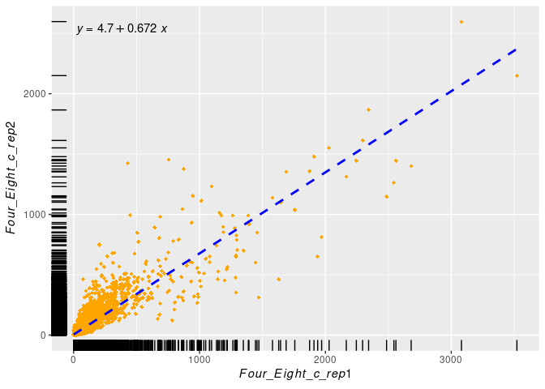

Homework
================
Sobhan Bahrami
2/3/2022

## R Markdown

This is an R Markdown document. Markdown is a simple formatting syntax
for authoring HTML, PDF, and MS Word documents. For more details on
using R Markdown see <http://rmarkdown.rstudio.com>.

When you click the **Knit** button a document will be generated that
includes both content as well as the output of any embedded R code
chunks within the document. You can embed an R code chunk like this:

``` r
read_counts <- read_tsv("/home/sobhan/Desktop/Bowtie_aligned_>=1_time_normalized_by_read_counts.csv")
```

    ## Rows: 15544 Columns: 7

    ## ── Column specification ────────────────────────────────────────────────────────
    ## Delimiter: "\t"
    ## chr (1): Gene
    ## dbl (6): Two_Four_c_rep1, Two_Four_c_rep2, Four_Eight_c_rep1, Four_Eight_c_r...

    ## 
    ## ℹ Use `spec()` to retrieve the full column specification for this data.
    ## ℹ Specify the column types or set `show_col_types = FALSE` to quiet this message.

``` r
print(read_counts)
```

    ## # A tibble: 15,544 × 7
    ##    Gene   Two_Four_c_rep1 Two_Four_c_rep2 Four_Eight_c_rep1 Four_Eight_c_rep2
    ##    <chr>            <dbl>           <dbl>             <dbl>             <dbl>
    ##  1 g00001          0                  0                 0                 0  
    ##  2 g00002          0                  0                 0                 0  
    ##  3 g00003          0                  0                 0                 0  
    ##  4 g00004          0.0676             0                 0                 0  
    ##  5 g00005          0                  0                 0                 0  
    ##  6 g00006          0                  0                 0                 0  
    ##  7 g00007          0                  0                 0                 0  
    ##  8 g00008         59.5               31.8              44.6              43.1
    ##  9 g00009         95.6               39.3              78.4              40.7
    ## 10 g00010        137.                59.6             122.               60.6
    ## # … with 15,534 more rows, and 2 more variables: Eight_Sixteen_c_rep1 <dbl>,
    ## #   Eight_Sixteen_c_rep2 <dbl>

``` r
Average<-c(Two_Four_c_rep1=mean(read_counts$Two_Four_c_rep1),Two_Four_c_rep2=mean(read_counts$Two_Four_c_rep2),Four_Eight_c_rep1=mean(read_counts$Four_Eight_c_rep1),Four_Eight_c_rep2=mean(read_counts$Four_Eight_c_rep2),Eight_Sixteen_c_rep1=mean(read_counts$Eight_Sixteen_c_rep1),Eight_Sixteen_c_rep2=mean(read_counts$Eight_Sixteen_c_rep2))
Average
```

    ##      Two_Four_c_rep1      Two_Four_c_rep2    Four_Eight_c_rep1 
    ##             31.64043             22.64134             32.68344 
    ##    Four_Eight_c_rep2 Eight_Sixteen_c_rep1 Eight_Sixteen_c_rep2 
    ##             26.66441             30.74857             39.57826

## Including Plots

You can also embed plots, for example:

    ## `geom_smooth()` using formula 'y ~ x'

    ## png 
    ##   2

    ## `geom_smooth()` using formula 'y ~ x'

<!-- -->

    ## null device 
    ##           1

    ## `geom_smooth()` using formula 'y ~ x'

    ## null device 
    ##           1

Note that the `echo = FALSE` parameter was added to the code chunk to
prevent printing of the R code that generated the plot.
